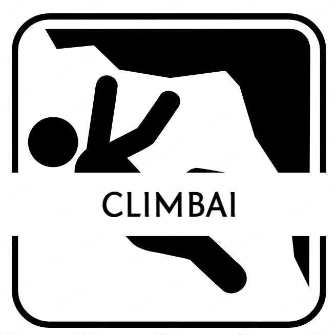

<!-- PROJECT LOGO -->
 

  

  <h3 align="center">ClimbAI</h3>

  

    Cloud-based Computer Vision System for Enabling Visually Handicapped Individuals to Participate in Rock Climbing
   

<!-- TABLE OF CONTENTS -->

  
Table of Contents

  <ol>
    <li><a href="#about-the-project">About The Project</a></li>
    <li><a href="#overall-software-solutions">Software Architecture Diagram</a></li>
    <li><a href="#built-with">Built With</a></li>
    <li>
      <a href="#ai-and-algorithm">AI and Algorithm</a>
    </li>
    <li>
      <a href="#user-applications">User Applications</a>
    </li>
    <li>
      <a href="#cloud-infrastructure">Cloud Infrastructure</a>
    </li>
    <li><a href="#video-demo">Video Demo</a></li>
    <li><a href="#acknowledgments">Acknowledgments</a></li>
  </ol>

<!-- ABOUT THE PROJECT -->

## About The Project

This project aims to create a technology-assistive solution that will enable visually impaired individuals to participate in rock climbing. The proposed solution will leverage computer vision technology to help visually impaired climbers navigate rock holds by analysing video streams and providing real-time guidance via audio means. The project will involve the development of custom software to process the video streams and generate the necessary guidance, as well as the creation of a cloud-based infrastructure to enable seamless deployment of the solution. Ultimately, the goal of this project is to promote inclusion and accessibility in the sport of rock climbing, allowing visually impaired individuals to enjoy the physical and mental benefits of this challenging activity.

Overall, the project deliverables is separated into 3 components: AI & Algorithms, User Applications, Cloud Infrastructure, which are taken charge by each team member: Boon Kong, Xinrui, Riyan respectively. The overall software architecture and solutions are as follows:

## Overall Software Solutions
### 
![Product Name Screen Shot][product-screenshot]

### Built With

This section outlines any major frameworks/libraries used to bootstrap our project.

- [![React][react.js]][react-url]
- [![Android][android]][android-url]
- [![watchOS][watchos]][watch-url]
- [![pyTortch][pytorch]][pytorch-url]
- [![detectron2][detectron2-img]][detectron2]
- [![mediapipe][mediapipe-img]][mediapipe]
- [![aws][aws]][aws-url]
- [![mq][mq]][mq-url]
- [![ant-media][ant-media]][ant-media-url]

<!-- AI and Algorithm -->

# AI and Algorithm

## Artificial Intelligence

We utilised 2 forms of computer vision in our project, mainly instance segmentation of climbing holds using Facebook's [Detectron2] library with Mask R-CNN model, and pose estimation of climber's key-points using Google's [MediaPipe] library.

### Technical Details
1. The best 100 images of "bouldering wall stock images" were scraped from Google search and labelled manually by us using the [VGG-Image-Annotator] and converted into COCO JSON format for input into Mask R-CNN model.
2. Image augmentation using the [Albumentation] library was utilised to improve model performance by ensuring flexibility in different environmental conditions.
3. The base model was fine-tuned and hyperparameter tuning was performed, achieving a class accuracy of 93.8% and AP of 84.0 using the Cosine Annealing learning rate scheduler.
4. We extracted climber key-points (elbows, wrists and feet) from the MediaPipe Pose output in every frame to get the real-time location of the user.

## Algorithm

Our algorithm helps visually-impaired climbers scale climbing routes by giving them guidance to the next hold using sound output as an indicator of distance. The detailed [algo-logic-diagram] shows the outline of how our algorithm works.

### Technical Details
1. Once the app is activated on the user's mobile device, video frames are livestreamed to the Python environment hosted on an AWS EC2 instance.
2. The Mask R-CNN model extracts segmentations of holds and MediaPipe Pose model extracts key-points of climber from the video frames.
3. Hold colours are classified using the HSV colour range.
4. When all 4 user limbs are on the same coloured holds, climb would be started and direction guidance will be initiated.
5. When user is on 3-point contact (e.g. moving only 1 limb), the next nearest hold is determined and euclidean distance is calculated.
6. Audio will be streamed via a queue to the user's mobile device with frequency corresponding to the distance away from the hold.
7. Climb will end when both hands of the user has touched the highest hold.

## Results

We tested our entire algorithm on 7 test videos of actual climbs performed on real bouldering walls that we have visited, and summarized our results as shown below:

- Instance Segmentation Accuracy: 88.3%
- Pose Estimation Accuracy: 91.0%
- Target Hold Prediction Accuracy: 75.3%
- Audio Output Accuracy: 70.3%

# User Applications

## Apple Watch

Serves to trigger the start of our cloud AI inference and track progress through timing and health statistics

### Technical Details

1. Our Apple Watch app is developed using SwiftUI and integrates Apple HealthKit to retrieve user health information.
2. Accessibility was a core consideration during the design process, ensuring that the app features clear, spoken instructions that can be easily followed by visually impaired users.
3. We use HTTP API calls to populate a cloud database with user data, including information on time, calories, and heart rate.

## Web Dashboard

Mainly meant for the climber's coach to keep track of the climber's performance through weekly, monthly, yearly overviews

### Technical Details

1. Our Web Dashboard is built using React and JavaScript, providing a modern and responsive user interface.
2. We leverage the power of AWS Amplify to seamlessly integrate and access cloud databases, enabling us to easily store and retrieve data from a wide range of sources.

## Android App

Serves as a portable client application, allowing the climber to live stream the current climbing session, get real-time inference from the cloud AI on the next recommended rock hold, and receive audio feedback from the phone itself.

### Technical Details

1. Our Android app utilizes the Real-Time Messaging Protocol (RTMP) to transmit live footage of the climber's data to our cloud-based AI for inference, enabling real-time analysis and guidance.
2. We leverage multi-threading and asynchronous programming techniques to ensure that the app can constantly listen for audio information from the cloud AI using a message queue. The appropriate audio is then natively played in real-time to guide the climber, providing an immersive and interactive experience.

# Cloud Infrastructure
With key considerations such as availability, scalability, performance and security in consideration, we have deploy a vast majority of compute workloads on AWS.
 
## Cloud Solutioning
The project uses core AWS services to support several processes in a largely decoupled and serverless architecture:  
[software-architecture-screenshot]

1. The user mounts his mobile phone securely (e.g. on a tripod) to capture the climbing route on the rockwall in his camera frame. He then clicks on the <i>Start Streaming</i> button on the mobile app. The mobile app would start streaming the live camera feed to an RTMP endpoint hosted on an EC2 instance.
2. When the climber is in position on the rockwall, he may start the climb session by clicking on the <i>Start Climb</i> button on the watch. This sends out an HTTP request to an endpoint on API Gateway. A Lambda function is triggered by this HTTP request and in turn prompts the <i>ClimbAI</i> EC2 instance to begin ingesting the live camera stream. 
3. Computer vision inference and algorithmic processing workloads are performed on live video frames, producing output parameters such as relative distance to the next hold and the body part in motion.
4. These output parameters are put into an SQS Queue, in turn to be consumed by the mobile app.
5. Upon receiving the relative distance and body part data, the mobile app processes it and modulates an audio waveform to be played by the earphones worn by the climber. The climber interprets the audio tones to assist him in his climb.
6. After the climb is completed, the climber may click on the <i>Stop Climb</i> button on the watch to terminate his climb session. Upon this, the watch sends an HTTP request, containing data from the climb session, to another endpoint on the API Gateway. This triggers another Lambda function to insert a record into a persistent data store hosted by DynamoDB.
7. The web application will be updated with these new records and display them on a dashboard hosted by AWS Amplify on the public internet.

<!-- VIDEO DEMO -->

## [Video Demo]

This short video demonstration shows how a user can utilize ClimbAI to track the progress of a climb. Accessibility features shown help to create a seamless climbing experience for visually-impaired climbers. Once the climber has all 4 limbs on the red-coloured holds, the climb will be initiated and the recommender system will start giving guidance to red holds. The frequency of the sound output increases as the climber moves nearer to the target hold, indicating distance away from the hold to the climber. When the climber touches the target hold, a distinct beep serves as a cue that he has reached. The climb ends when the climber has both hands on the final red hold.

<!-- ACKNOWLEDGMENTS -->

# Acknowledgments

The team is extremely grateful to the following people and organizations for the support and mentorship throughout the project.

1. Professor Lin Weisi | Project Supervisor
2. Dr Xuan Jing | Project Co-Supervisor
3. boulder+ | Climbing Gym

<!-- MARKDOWN LINKS & IMAGES -->
<!-- https://www.markdownguide.org/basic-syntax/#reference-style-links -->

[product-screenshot]: assets/overall-solution.png
[react.js]: https://img.shields.io/badge/React-20232A?style=for-the-badge&logo=react&logoColor=61DAFB
[react-url]: https://reactjs.org/
[android]: https://img.shields.io/badge/Android-3DDC84?style=for-the-badge&logo=android&logoColor=white
[android-url]: https://developer.android.com/
[watchos]: https://img.shields.io/badge/Apple-999999?style=for-the-badge&logo=apple&logoColor=white
[watch-url]: https://developer.apple.com/watchos/
[pytorch]: https://img.shields.io/badge/PyTorch-EE4C2C?style=for-the-badge&logo=pytorch&logoColor=white
[pytorch-url]: https://pytorch.org/
[detectron2-img]: https://img.shields.io/badge/Detectron2-008CBA?style=for-the-badge&logo=detectron2&logoColor=white
[detectron2]: https://ai.facebook.com/tools/detectron2/
[mediapipe-img]: https://img.shields.io/badge/Mediapipe-00A5E4?style=for-the-badge&logo=mediapipe&logoColor=white
[mediapipe]: https://developers.google.com/mediapipe
[aws]: https://img.shields.io/badge/AWS-232F3E?style=for-the-badge&logo=amazon-aws&logoColor=white
[aws-url]: https://aws.amazon.com/
[mq]: https://img.shields.io/badge/AWS%20SQS-FF9900?style=for-the-badge&logo=amazon-sqs&logoColor=white
[mq-url]: https://aws.amazon.com/sqs/
[ant-media]: https://img.shields.io/badge/Ant%20Media-FF5733?style=for-the-badge&logo=ant-media-server&logoColor=white
[ant-media-url]: https://antmedia.io/
[software-architecture-screenshot]: https://drive.google.com/file/d/10VzpZKkVAtlb9m8Vrmv_k3RpOdwNFwhU/view?usp=sharing
[algo-logic-diagram]: https://drive.google.com/file/d/1f4howkjsZ6SmW1u_paOCe2KLB10hCQFJ/view?usp=sharing
[VGG-Image-Annotator]: https://www.robots.ox.ac.uk/~vgg/software/via/via.html
[Albumentation]: https://albumentations.ai/
[Video Demo]:https://drive.google.com/file/d/1xvfbdPVJ21ZxWwTpDDylnJ_O_4rB0XaD/view?usp=sharing
